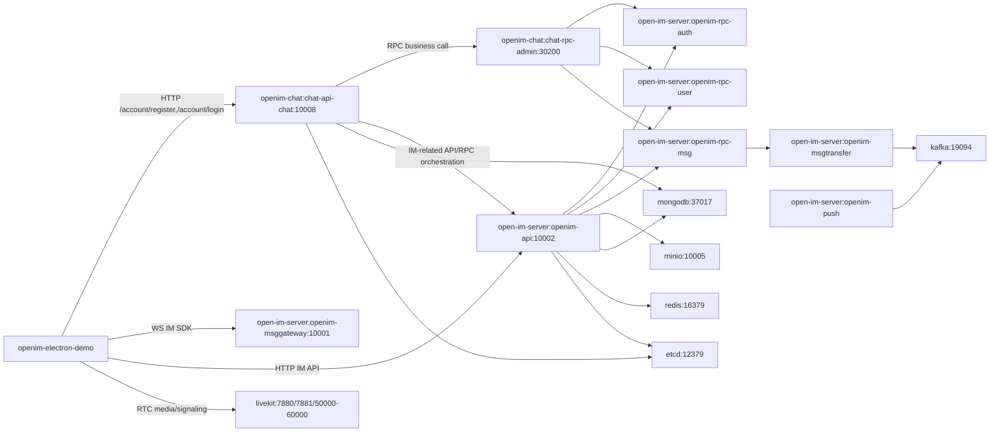

# OpenIM 全链路逐项验收（命令版）

目标：验证 `open-im-server + openim-chat + openim-electron-demo + livekit` 是否达到可用状态。  
执行环境：Linux shell（bash）。

## 0. 目录与代码齐备

```bash
ls -la /home/administrator/interview-quicker/openim
```

通过标准：
- 目录中至少存在：`open-im-server`、`openim-chat`、`openim-electron-demo`
- 如果你本地把 livekit 单独放在别处，也需要能定位到 livekit 目录或服务地址

---

## 1. open-im-server 运行状态

```bash
cd /home/administrator/interview-quicker/openim/open-im-server
./scripts/ops.sh status
./scripts/ops.sh ports
```

通过标准：
- `status` 显示服务正常
- `ports` 中看到 `10001`、`10002`

---

## 2. chat 服务端口与接口

```bash
ss -lntp | awk 'NR==1 || /:10008 /'
curl --noproxy '*' -sS -X POST "http://127.0.0.1:10008/account/login" \
  -H "Content-Type: application/json" \
  -H "operationID: check-chat-login" \
  -d '{"areaCode":"+86","phoneNumber":"test","password":"test","platform":5}'
```

通过标准：
- `10008` 有监听
- `/account/login` 返回 JSON（即使账号密码错误，也应返回结构化业务错误，不应是空响应/404）

---

## 3. 注册链路（chat）

```bash
curl --noproxy '*' -sS -X POST "http://127.0.0.1:10008/account/register" \
  -H "Content-Type: application/json" \
  -H "operationID: check-chat-register" \
  -d '{
    "verifyCode":"000000",
    "platform":5,
    "user":{
      "nickname":"u_test_01",
      "password":"P@ssw0rd123",
      "areaCode":"+86",
      "phoneNumber":"13800000001"
    }
  }'
```

通过标准：
- 返回业务 JSON（成功或可解释失败码）
- 接口路径可用，不是 404/502/空响应

说明：
- 若开启真实验证码，需先走 `code/send` 与 `code/verify`，上面仅用于验接口可用性

---

## 4. 登录结果字段校验（chat + IM）

```bash
curl --noproxy '*' -sS -X POST "http://127.0.0.1:10008/account/login" \
  -H "Content-Type: application/json" \
  -H "operationID: check-chat-login-fields" \
  -d '{"areaCode":"+86","phoneNumber":"13800000001","password":"P@ssw0rd123","platform":5}'
```

通过标准：
- 成功登录时响应中包含：`chatToken`、`imToken`、`userID`

---

## 5. 前端环境变量对齐

```bash
cd /home/administrator/interview-quicker/openim/openim-electron-demo
cat .env
```

通过标准：
- `VITE_WS_URL` 指向 `10001`
- `VITE_API_URL` 指向 `10002`
- `VITE_CHAT_URL` 指向 `10008`

---

## 6. 前端启动与页面可达

```bash
cd /home/administrator/interview-quicker/openim/openim-electron-demo
npm install
npm run dev
```

通过标准：
- 启动无致命报错
- 登录页正常打开
- 登录请求走 `VITE_CHAT_URL`（浏览器 Network 可见）

---

## 7. 登录后 IM SDK 连接检查

在前端登录成功后，检查：
- WebSocket 连接到 `10001`
- 不出现持续 token 失效循环报错
- 可拉到会话/用户基础数据

通过标准：
- 页面可进入主界面
- 会话列表可展示（哪怕为空）

---

## 8. 安全收口（上线前最低要求）

### 8.1 管理口限制（`/auth/get_admin_token`）
通过网关或防火墙确保公网不可直接访问。

### 8.2 替换默认 secret
检查并替换：

```bash
cat /home/administrator/interview-quicker/openim/open-im-server/config/share.yml
```

通过标准：
- `secret` 非默认值（不能是 `openIM123`）
- 前端不再依赖管理员 token 登录路径

---

## 9. 音视频（可选高级能力）

若要启用多方音视频，需额外部署 LiveKit 并完成 chat 侧配置。  
参考文档：
- https://github.com/openimsdk/chat
- https://github.com/openimsdk/chat/blob/main/HOW_TO_SETUP_LIVEKIT_SERVER.md
- https://github.com/livekit/livekit

通过标准：
- LiveKit 服务可达
- chat 配置正确
- 前端发起 RTC 不报鉴权或地址错误

---

## 10. 组件节点调用关系（含第三方依赖）

### 10.1 节点清单（当前配置视角）

- 前端节点
  - `openim-electron-demo`（Web/Electron 客户端）
- 业务层节点（openim-chat）
  - `chat-api-chat`：`10008`（见 `openim-chat/config/chat-api-chat.yml`）
  - `chat-rpc-admin`：`30200`（见 `openim-chat/config/chat-rpc-admin.yml`）
  - 服务注册发现：etcd `localhost:12379`（见 `openim-chat/config/discovery.yml`）
- IM 底座节点（open-im-server）
  - `openim-msggateway`：`10001`
  - `openim-api`：`10002`
  - `openim-rpc-auth/user/friend/group/msg/conversation/third`
  - `openim-msgtransfer`（多实例）
  - `openim-push`（多实例）
  - `openim-crontask`（多实例）
  - 实例基线见 `open-im-server/start-config.yml`
- 第三方依赖节点
  - MongoDB：`37017`（chat 与 server 都依赖）
  - Redis：`16379`
  - Kafka：`19094`
  - Etcd：`12379`
  - MinIO：`10005`
  - LiveKit：`7880`（信令），`7881`（RTC TCP），`50000-60000`（RTC UDP/TCP）
    - 见 `openim-chat/livekit/livekit.yaml`

### 10.2 调用关系图（业务+IM+RTC）



### 10.3 最关键的两条链路

- 登录链路（账号体系）
  - `front -> chat-api(10008) /account/login|/account/register -> chatToken/imToken`
- 即时通讯链路（IM能力）
  - `front(imToken) -> msggateway(10001) + openim-api(10002) -> open-im-server rpc/services`

---

## 11. 下一步执行计划（先能用再安全）

说明：以下为落地执行顺序，当前先写计划，不改代码。  
目标顺序：先保证前端走 chat 登录可用，再做高危口收口与密钥轮换。

### 11.1 第一步（可用性优先）

- 确认前端只走 chat 登录路径（不走管理员 token）
  - 检查 `openim-electron-demo/src/api/login.ts` 是否仅调用 `VITE_CHAT_URL` 下 `/account/register`、`/account/login`
  - 检查前端代码不存在 `/auth/get_admin_token` 调用
- 确保 chat 服务 `10008` 在线
  - 在 `openim-chat` 执行：`mage build && mage start && mage check`
  - 验证 `ss -lntp | awk 'NR==1 || /:10008 /'`

### 11.2 第二步（立刻收口高风险）

- 收口 `open-im-server` 管理员 token 接口
  - 对 `/auth/get_admin_token` 增加访问限制（仅内网/白名单）
  - 公网调用返回拒绝
- 轮换默认 secret（同步）
  - 修改 `open-im-server/config/share.yml` 的 `secret`
  - 同步修改 `openim-chat/config/share.yml` 的 `openIM.secret`（必须一致）
  - 更新本地测试脚本默认密钥（如 `scripts/smoke-test.sh`）

### 11.3 第三步（安全与回归验证）

- 接口验证
  - 内网调用 `/auth/get_admin_token` 成功
  - 非白名单/公网调用被拒绝
- 登录验证
  - `/account/register` 正常（chat）
  - `/account/login` 返回 `chatToken + imToken + userID`
  - 前端可用 `imToken` 登录 SDK（`10001/10002`）
- 验收回归
  - 运行本文件“逐项验收命令版”1~8项，全部通过

### 11.4 计划完成标准

- 前端登录链路：仅 chat `/account/*`
- 管理口：`/auth/get_admin_token` 不再公网可用
- 默认密钥：`openIM123` 不再用于生产/当前联调环境
- 最小主流程可用：注册 -> 密码登录 -> 进入 IM 会话

写几个组件之间的调用关系到新文档，放到/home/administrator/interview-quicker/openim/open-im-server  然后组个